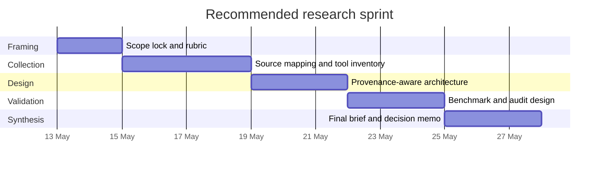
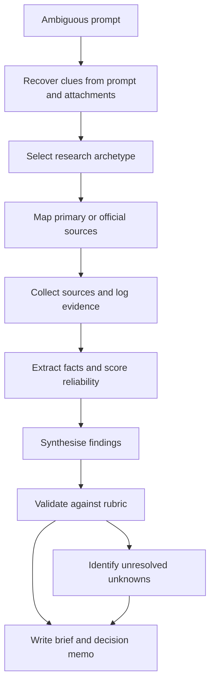

# Interpreting “Research This” Into a Rigorous Research Programme

## Executive summary

A prompt as short as “Research this” is ambiguous on its own, but the attached project note sharply changes the prior. It describes a **CareerOps Resume Automation System** and breaks the work into nine requirement areas: structured career data, claim/evidence tracking, a resume rules engine, LaTeX/PDF generation, job-description analysis, version registry, achievement capture, a Claude Code-native architecture, and post-generation PDF validation. That makes an applied technology-and-methods research path far more likely than a generic essay or news summary. fileciteturn0file0

Given that signal and the request to optimise for **general utility**, the two best research archetypes to prioritise are an **applied technology landscape** and a **methods/literature review**. A quick scan of primary sources shows that strong building blocks already exist for schema-driven resume data, ATS-conscious rendering, public skill/occupation taxonomies, and `urlClaude Code docsturn1search5` extension points. What still looks materially under-served in the reviewed documentation is end-to-end provenance: a career knowledge base in which every resume bullet is blocked unless it is backed by a verified fact, plus a version registry linking resume snapshots to applications and outcomes. That conclusion is an inference from the reviewed sources rather than proof that no such product exists anywhere. citeturn6view0turn7view0turn5view0turn5view1turn4view1turn4view4turn4view5turn4view6turn4view7turn4view8

The most efficient next step is therefore not to start coding immediately. It is to run a short, provenance-first research sprint that first locks evaluation criteria, then expands the tool inventory, then designs the evidence-aware schema and validation model, and only then prototypes the local workflow. That sequencing follows both the uploaded brief and the current state of the ecosystem: rendering and keyword tooling are comparatively mature, while the evidence layer is the genuinely novel part. fileciteturn0file0 citeturn6view0turn5view0turn10search1turn13search0

## Likely interpretations and topic options

The table below turns the vague instruction into six plausible research briefs across different domains. The first two are the ones I would select first because they are both broadly reusable and the best fit to the uploaded note. fileciteturn0file0

| Topic archetype | Research question and scope | Priority sources | Methodology | Expected deliverables | Time, effort, risks |
|---|---|---|---|---|---|
| **Applied technology product comparison**<br>**Highest fit** | **Question:** Which open-source or commercial tools can cover the CareerOps stack, and where are the gaps?<br>**Scope:** resume-as-code engines, JD parsers, trackers, local orchestration, PDF validation. | Official product docs, upstream repos, standards/taxonomies, benchmark notes. | Capability matrix; maintenance scan; privacy/deployment scoring; limited install-and-test verification. | Build-vs-buy matrix, tool shortlist, gap map, recommended reference architecture. | **2–4 researcher days; medium effort.**<br>**Risks:** vendor overclaiming, stale OSS, hidden SaaS assumptions. |
| **Methods and literature review**<br>**Highest fit** | **Question:** Which technical methods best support grounded resume generation, provenance, matching, and validation?<br>**Scope:** attribution, retrieval, provenance models, skill extraction, semantic matching, evaluation. | Original papers, standards bodies, government labour taxonomies. | Structured literature scan; standards review; method-to-requirement mapping. | Method landscape, architecture patterns, evaluation rubric, ranked technical options. | **3–5 researcher days; medium effort.**<br>**Risks:** literature is not resume-specific, so translation into practice is required. |
| **Market analysis and build-vs-buy** | **Question:** Is it cheaper and faster to assemble existing tools than to build a local-first stack from scratch?<br>**Scope:** pricing, licensing, deployment, maintenance, privacy trade-offs. | Official pricing/licensing pages, enterprise docs, repo activity, support/deployment docs. | Total-cost model; scenario analysis; vendor strategy comparison. | Total-cost estimate, implementation scenarios, vendor/no-vendor recommendation. | **2–3 researcher days; medium effort.**<br>**Risks:** opaque enterprise pricing, weak comparability across vendors. |
| **Policy and standards brief** | **Question:** What legal, privacy, accessibility, and interoperability constraints should shape a resume-automation system?<br>**Scope:** data retention, employment AI risk, accessibility, document interoperability, auditability. | Government/standards sources, regulatory guidance, public framework docs. | Jurisdiction matrix; standards checklist; risk register. | Compliance memo, safe-default data policy, governance checklist. | **2–4 researcher days; medium effort.**<br>**Risks:** jurisdiction dependence; fast-moving regulation. |
| **Historical and industry evolution summary** | **Question:** How did ATS parsing, structured resume formats, and resume-as-code evolve, and what lessons matter now?<br>**Scope:** early ATS workflows, structured schemas, modern AI resume tooling. | Original project docs, formative blog posts, archives, platform histories. | Timeline reconstruction; comparative synthesis; design-lesson extraction. | Historical timeline, design lessons, dead ends to avoid. | **1–2 researcher days; low-to-medium effort.**<br>**Risks:** incomplete archives, survivorship bias. |
| **Scientific experiment replication and benchmark** | **Question:** Can a local pipeline generate factual, ATS-safe, role-tailored resumes better than a baseline?<br>**Scope:** dataset, ablations, parser tests, human review, reproducibility. | Original papers, benchmark docs, parser APIs, public datasets. | Controlled evaluation design; metric selection; replicate/extend prior work. | Benchmark protocol, results table, reproducibility package, test harness spec. | **5–10 days plus coding; high effort.**<br>**Risks:** annotation burden, API cost, weak ground-truth data. |

A concise interpretation of each option is useful before choosing the first pass:

**Applied technology product comparison** is the most direct response when the hidden request is probably “find the right stack”. It is best when a decision-maker needs a shortlist, a gap map, and a build-vs-buy view quickly.

**Methods and literature review** is the right companion when the product landscape is clearly incomplete. It tells you which parts are routine engineering and which parts are still research-heavy.

**Market analysis and build-vs-buy** becomes useful once functional gaps are known and the real decision is budgetary or operational rather than purely technical.

**Policy and standards brief** matters when private career data, employment-related AI, or accessibility requirements are material. It is especially important if the project might later move from purely local use into team or SaaS settings.

**Historical and industry evolution summary** is less urgent for immediate implementation, but useful if the goal is strategic positioning or understanding why current tools look the way they do.

**Scientific experiment replication and benchmark** is the most rigorous end-state. It is usually not the first step unless the missing request explicitly asked for proof, comparison metrics, or publication-quality evidence.

## Technology landscape scan

The current technology landscape suggests that the uploaded brief should be treated as a **composed system**, not a single-tool procurement problem. `urlJSON Resumeturn20search4` offers a durable open schema for basics, work history, education, skills, projects and more, and it now also publishes a separate `urljob-description schematurn20search0` that could normalise incoming vacancies. Its current official CLI supports validation and theme-based rendering to HTML/PDF, which is useful for a structured career database layer, but literal LaTeX is not the centre of gravity in the present docs. `urlHackMyResumeturn0search2`, by contrast, explicitly supports JSON/YAML inputs, schema validation, keyword analysis, and LaTeX/PDF output from a single source of truth; however, its GitHub page still lists the latest release as **12 February 2018**, so it looks more like a valuable reference component than a low-risk modern foundation. citeturn5view1turn20search0turn20search6turn5view0

`urlRenderCV docsturn0search4` are the strongest reviewed documentation for a modern schema-first renderer. The current docs emphasise YAML authoring, JSON Schema-backed validation, editor autocompletion, template overrides, multilingual support, and an AI agent skill that works with Claude Code. Even more notable is the `urlRenderCV ATS compatibility reportturn7view0`, which is unusually concrete: it reports tests on 20 PDFs across themes, with clean text extraction and strong performance across multiple commercial parsing engines. For the uploaded brief, that makes RenderCV highly relevant for the rendering and parser-safety layer. The caveat is important, though: the same report states that current PDFs are generated via **Typst**, so RenderCV is best interpreted as an ATS-strong renderer rather than a strict `.tex` pipeline. citeturn6view0turn7view0

For orchestration, the official `urlClaude Code skills docsturn1search0`, `urlsubagents docsturn8search1`, `urlhooks referenceturn8search15`, and `url.claude directory docsturn8search10` collectively provide almost exactly the extension surfaces the note asks for: reusable slash-command workflows, specialist workers in isolated context windows, and lifecycle hooks that can inspect, block, or validate work before and after tools run. The settings and directory docs also confirm project-local configuration paths such as `.claude/settings.json`, `.claude/settings.local.json`, and `.claude/agents/`, which fit a local-first implementation model well. Claude Code therefore looks like a viable **control plane**, but not the missing provenance data layer itself. citeturn4view1turn9view0turn9view1turn9view2turn4view2

For JD analysis and registry functions, the reviewed ecosystem splits into public taxonomies and commercial workflow tools. `urlO*NET Databaseturn2search8` and `urlESCO APIturn2search5` are the strongest primary sources for normalising occupations, skills and worker requirements. Commercial services such as `urlHuntrturn2search2`, `urlTeal Job Trackerturn2search3`, and `urlJobscanturn3search0` show that application tracking, keyword matching, and tailored-resume workflows are already market-proven. But in the reviewed product docs they remain SaaS job-search tools, not provenance-first local systems in which every bullet is blocked unless it maps to a source fact and every output is stored as an auditable snapshot linked to application outcomes. That last conclusion is an inference from what the reviewed documentation does and does not expose. fileciteturn0file0 citeturn4view4turn4view5turn4view6turn4view7turn4view8

### Prioritised source stack

1. `urlRenderCV docsturn0search4` — modern schema-first rendering baseline with YAML input, JSON Schema, template overrides and agent-skill support. citeturn6view0  
2. `urlRenderCV ATS reportturn7view0` — strongest primary evidence in this scan for parser-safe PDF generation. citeturn7view0  
3. `urlJSON Resume schematurn0search1` — portable open schema for structured career data. citeturn5view1  
4. `urlJSON Resume job-description schematurn20search0` and `urlCLI docsturn20search6` — useful for JD normalisation, validation and export workflows. citeturn20search0turn20search6  
5. `urlHackMyResume repositoryturn0search2` — important reference point for literal LaTeX output, validation and local-first use, with clear maintenance-risk signals. citeturn5view0  
6. `urlClaude Code skillsturn1search0` — confirms command-style workflow extension. citeturn4view1  
7. `urlClaude Code subagentsturn8search1` and `urlhooks referenceturn8search15` — provide isolation, delegation and validation control points. citeturn9view0turn9view1  
8. `urlO*NET Databaseturn2search8` and `urlESCO APIturn2search5` — best public taxonomies for skill and occupation normalisation. citeturn4view4turn4view5  
9. `urlHuntrturn2search2`, `urlTeal Job Trackerturn2search3`, and `urlJobscanturn3search0` — representative evidence that tracking and tailoring workflows are commercially mature, even if provenance isn’t. citeturn4view6turn4view7turn4view8  

## Methods and literature scan

The methods literature that best fits the uploaded brief is not generic text generation research; it is the narrower body of work on **retrieval, attribution, provenance, claim-level evaluation, and job-posting extraction**. The original `urlRAG paperturn11search1` is still the canonical starting point because it explicitly introduced generation backed by external non-parametric memory and foregrounded provenance as a practical issue. After that, the most relevant line of work is attributed generation: `urlGopherCiteturn16search1` trained open-book QA with verified quotes and abstention, `urlAttributed QAturn16search12` framed attribution as a first-class evaluation problem, `urlFActScoreturn10search0` turned factuality into atomic-claim scoring, `urlAttribute First, then Generateturn17academia12` pushed towards local, fine-grained attribution, and `urlfine-grained citation rewardsturn17search0` showed that citation quality can itself be an optimisation target. For an evidence-backed resume pipeline, the practical implication is strong: every planned bullet should be treated as an atomic supported claim, not as freeform summarisation. That is unusually well aligned with the note’s “no inference, no hallucination” requirement. fileciteturn0file0 citeturn11search1turn16search1turn16search12turn10search0turn17academia12turn17search0

For provenance modelling, the most transferable standards base comes from the entity["organization","World Wide Web Consortium","web standards body"] and the entity["organization","National Institute of Standards and Technology","us standards agency"]. `urlW3C PROV-DMturn10search1` defines provenance in terms of entities, activities and agents, explicitly so users can assess quality, reliability and trustworthiness. `urlNIST AI RMF 1.0turn13search3` and the `urlNIST Generative AI Profileturn13search0` provide the governance counterpart: lifecycle risk management, traceability, evaluation, and human oversight. Translating that into system design suggests that the career database should not merely store “resume sections”; it should store **facts, sources, transformations, and generated claims** as separate linked objects. citeturn10search1turn10search4turn13search3turn13search0

JD analysis is comparatively well served by existing research. `urlSkillSpanturn14search0` created a strong dataset for hard and soft skill extraction from English job postings, `urlweak-supervision skill extractionturn14search1` showed that taxonomies such as ESCO can seed extraction without expensive labels, `urlSentence-BERTturn12search3` remains a pragmatic baseline for semantic similarity, and `urlJobBERTturn14search11` showed that explicit skill-aware title modelling improves job-title normalisation. Combined with the public `urlO*NET Databaseturn2search8` and `urlESCO APIturn2search5`, these sources provide a credible path for the uploaded brief’s JD parsing, match scoring, and keyword-gap detection requirements. fileciteturn0file0 citeturn14search0turn14search1turn12search3turn14search11turn4view4turn4view5

The main evaluation lesson from this literature is that **citation presence is not enough**. GopherCite itself notes that a claim can be supported by quoted evidence and still be false in the larger sense, and FActScore exists precisely because long-form factuality cannot be judged well with coarse whole-response labels. For this brief, a serious benchmark therefore needs at least four layers: fact-existence checks against the career KB, citation-span or source-link checks, ATS/PDF parse checks, and human honesty/relevance review. citeturn16search1turn10search0turn7view0

### Prioritised source stack

1. `urlRetrieval-Augmented Generation for Knowledge-Intensive NLP Tasksturn11search1` — foundational retrieval-backed generation paper. citeturn11search1  
2. `urlTeaching language models to support answers with verified quotesturn16search1` — closest early analogue to evidence-backed generation with abstention. citeturn16search1  
3. `urlAttributed QAturn16search12` — formalises attribution as a measurable QA task. citeturn16search0turn16search12  
4. `urlFActScoreturn10search0` — strongest cited source here for atomic factual evaluation. citeturn10search0turn10search6  
5. `urlAttribute First, then Generateturn17academia12` — useful design pattern for local, fine-grained attribution. citeturn17academia12  
6. `urlTraining Language Models to Generate Text with Citations via Fine-grained Rewardsturn17search0` — shows citation quality can be directly optimised. citeturn17search0  
7. `urlW3C PROV-DMturn10search1` — best-fit provenance standard for a fact-evidence ledger. citeturn10search1turn10search4  
8. `urlNIST AI RMF 1.0turn13search3` and `urlGenerative AI Profileturn13search0` — governance and risk-management layer for traceability and evaluation. citeturn13search3turn13search0  
9. `urlSkillSpanturn14search0` and `urlweak-supervision skill extractionturn14search1` — strongest immediate sources for extracting skills from job descriptions. citeturn14search0turn14search1  
10. `urlSentence-BERTturn12search3`, `urlJobBERTturn14search11`, `urlO*NET Databaseturn2search8`, and `urlESCO APIturn2search5` — practical basis for semantic matching, title normalisation, and controlled keyword expansion. citeturn12search3turn14search11turn4view4turn4view5  

## Recommended next-step plan

Because the uploaded note is fundamentally a **design and tool-selection brief**, the most efficient path is: **technology landscape first, methods second, prototype third**. That ordering avoids wasting effort on commodity layers that are already solved well enough, and concentrates custom design work on provenance, evidence gating, and version registry—exactly the areas the note itself flags as hardest to find off the shelf. fileciteturn0file0 citeturn6view0turn5view0turn10search1turn10search0

| Date window | Work package | Main output | Effort estimate |
|---|---|---|---|
| **2026-05-13 to 2026-05-14** | Scope lock and evaluation rubric | Final research questions, requirement taxonomy, evidence-log schema, scoring rubric | 0.5–1.0 day |
| **2026-05-15 to 2026-05-18** | Source collection and tool inventory | Primary-source register, capability matrix, maintenance/deployment notes | 1.5–2.0 days |
| **2026-05-19 to 2026-05-21** | Provenance-aware architecture synthesis | Career fact schema, claim-evidence model, version-registry design | 1.5–2.0 days |
| **2026-05-22 to 2026-05-24** | Validation and benchmark design | ATS/PDF validation plan, fact-checking protocol, sample evaluation set | 1.5–2.0 days |
| **2026-05-25 to 2026-05-27** | Final research brief and decision memo | Executive memo, build-vs-buy recommendation, appendices, next-phase prototype spec | 1.0–1.5 days |



## Research workflow

The workflow below deliberately puts **evidence capture before synthesis**. That is the right pattern both for the uploaded brief’s no-fabrication constraint and for the provenance/evaluation methods surfaced in the scan. fileciteturn0file0 citeturn10search1turn13search0turn10search0



## Full research brief template

```markdown
# Research Brief Title

## Executive summary
- Decision to support:
- One-paragraph answer:
- Recommended action:
- Confidence level:
- Biggest unresolved unknown:

## Decision context
- Request origin:
- Audience:
- Deadline:
- Why this research matters now:
- What decision will it change:

## Research questions
### Primary question
- ...

### Secondary questions
- ...
- ...

### Non-goals
- ...
- ...

## Scope
- In scope:
- Out of scope:
- Geographic scope:
- Timeframe:
- Domain assumptions:
- Constraints:
- Definitions and terminology:

## Source strategy
### Priority hierarchy
1. Official documentation / standards / government data
2. Original papers / benchmark docs
3. Upstream repositories and release notes
4. Secondary analysis only if primary evidence is missing

### Search log
- Query:
- Source:
- Date searched:
- Why included / excluded:

## Evaluation rubric
| Criterion | Weight | How measured | Pass threshold |
|---|---:|---|---:|
| Accuracy / factual support |  |  |  |
| Traceability / citations |  |  |  |
| Relevance to decision |  |  |  |
| Maintainability / maturity |  |  |  |
| Privacy / deployment fit |  |  |  |
| Cost / effort |  |  |  |

## Findings
### Finding one
- What the evidence says:
- Best supporting sources:
- Contradictory evidence:
- Confidence:

### Finding two
- What the evidence says:
- Best supporting sources:
- Contradictory evidence:
- Confidence:

## Options
### Option A
- Description:
- Advantages:
- Disadvantages:
- Risks:
- Cost / effort:
- When to choose it:

### Option B
- Description:
- Advantages:
- Disadvantages:
- Risks:
- Cost / effort:
- When to choose it:

## Recommendation
- Recommended option:
- Why:
- Preconditions:
- What to do first:
- What not to build yet:

## Risks and unknowns
| Risk / unknown | Why it matters | Likelihood | Impact | Mitigation |
|---|---|---|---|---|
|  |  |  |  |  |

## Evidence register
| claim_id | claim_text | source_id | source_type | verification_status | notes |
|---|---|---|---|---|---|
| C-001 |  |  |  | verified / disputed / unresolved |  |

## Appendices
### Source register
- Full bibliography
- Release-note notes
- Repo activity notes
- Data dictionaries / schema references

### Method notes
- Inclusion criteria
- Exclusion criteria
- Limitations
- Reproducibility notes
```

